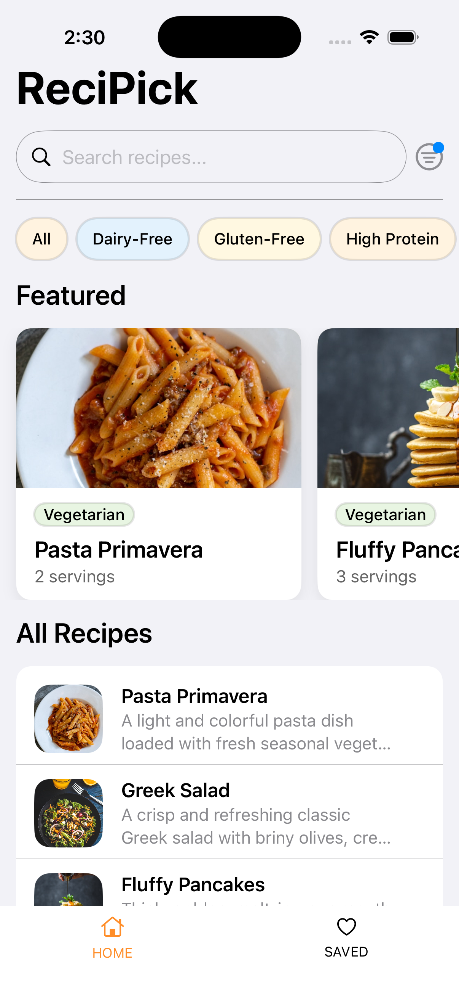
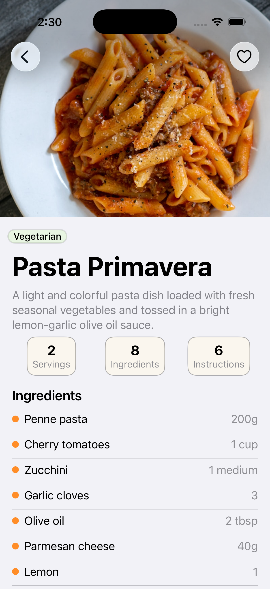
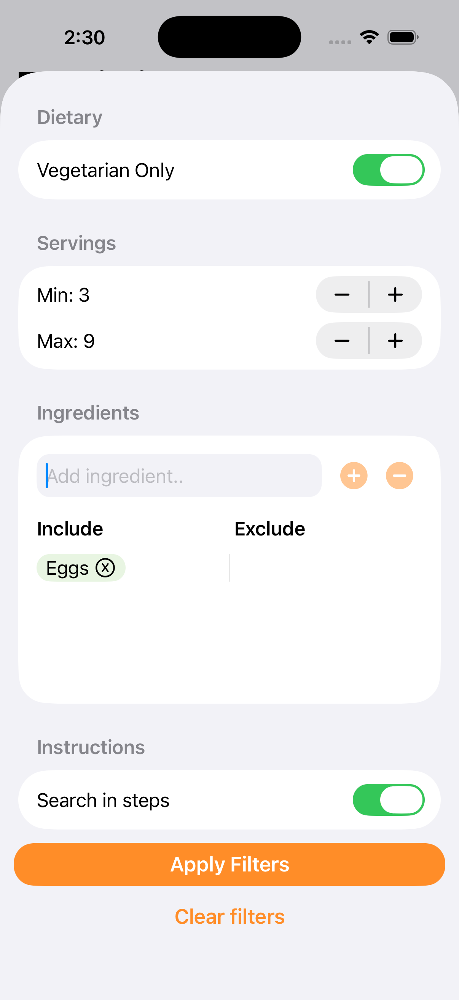
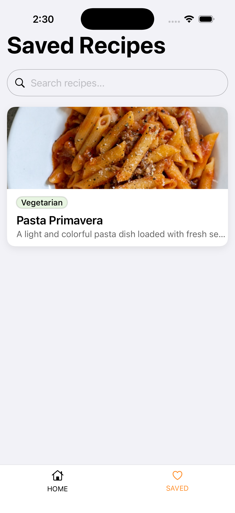

# ReciPick

A native iOS recipe browsing app built with Swift and SwiftUI.

---

## Screenshots

| Home | Detail | Filter | Saved |
|------|--------|--------|-------|
|  |  |  |  |

## Setup Instructions

### Requirements
- Xcode 15.0+
- iOS 16.0+
- Swift 5.9+

### Getting Started

1. Clone the repository:
```bash
git clone https://github.com/yourusername/ReciPick.git
```

2. Open the project:
```bash
cd ReciPick
open ReciPick.xcodeproj
```
---

## Architecture Overview

**ReciPick** follows the **MVVM** pattern with a feature-based folder structure.


**Dependencies**
- [Kingfisher](https://github.com/onevcat/Kingfisher) — used for loading and caching images.

**Repository Pattern**
- Repositories conform to a protocol, making it easy to swap the local JSON mock for a real API.


**Folder Structure**
- `App` — entry point, AppDelegate, ContentView
- `Core` — shared models, repository, extensions, and components
- `Features` — screens and feature-specific logic
```
ReciPick/
├── App/                  
├── Core/                 
│   ├── Components/       
│   ├── Extensions/       
│   ├── Models/           
│   ├── Repository/       
│   └── AppState.swift    
└── Features/
    ├── Home/             
    │   ├── Components/
    │   ├── ViewModel/    
    │   └── Views/
    ├── RecipeDetail/
    │   ├── Components/
    │   └── Views/
    └── Saved/
        ├── ViewModel/    
        └── Views/
```


---

## Key Design Decisions

### 1. Feature-based folder structure
Code is organized by feature rather than by type. This makes it easier to navigate, isolate, and scale individual features without affecting others.

### 2. Mock search endpoint
 To mimic how a real search API would work, a dedicated `searchRecipes` function inside `RecipeRepository` handles all filter logic (vegetarian, servings, ingredients, instruction search).

### 3. Mimic API call response time.
Added a `500ms` delay for both `loadRecipes` and `searchRecipes` function inside `RecipeRepository` to mimic the response time of an API call.

### 4. Custom bottom tab bar and navigation bar
A custom `BottomTabBarView` and `NavigationBarView` is used instead of the native one to allow full control over appearance and functions.

---
## Assumptions, Tradeoffs and Limitations

- No persistence/offline caching — saved recipes and active filters are stored in memory and reset on app restart.
- No real API — all data is loaded from a local JSON file bundled with the app.
- No pagination - all recipes are loaded at once.
- Limited dataset - mock data has only 15 recipes. located inside `recipes.json` file.
- No landscape mode. Only supports portrait mode.
- No dark mode. Only supports light scheme.

---

## Author

**Anthony Tan**  
